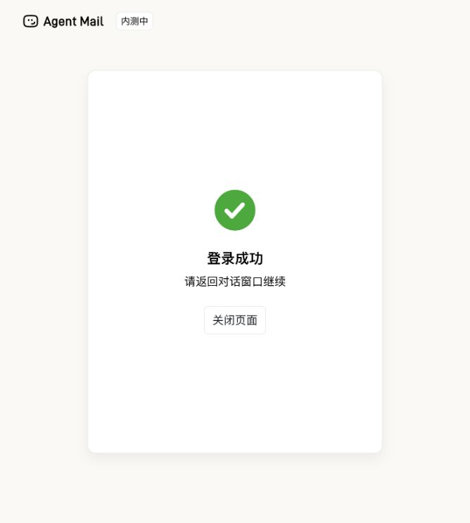
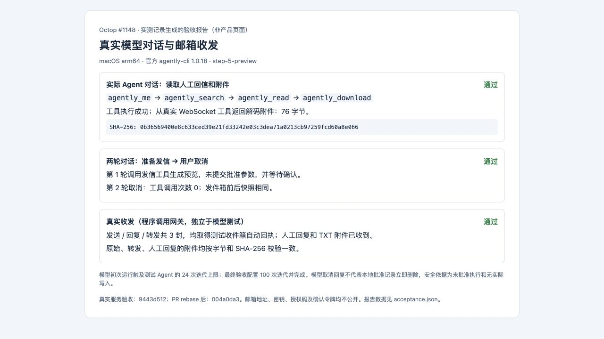
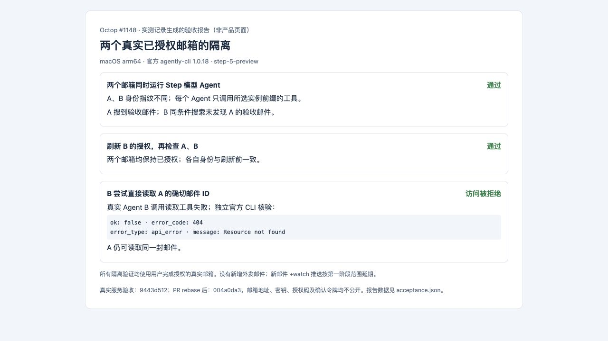

# Octop #1148 验收记录

这份公开记录从真实运行的私有验收文件中选择断言并脱敏。第 1、2 张图是产品/官方授权页面的原始截图；第 3、4 张图是实测记录生成的报告截图，不是产品聊天界面。没有包含 API 密钥、个人邮箱、邮件 ID、授权码、批准令牌、完整邮件正文或模型思考内容。

## 范围和版本

- 第一期 Agent Mail CLI 连接器：安装、独立实例授权、11 个邮件/附件工具、两阶段写确认。`+watch` 新邮件推送按认领范围延期。
- macOS arm64，官方 `@tencent-qqmail/agently-cli` / native CLI **1.0.18**；真实模型 **step-5-preview**，通过 Step Plan 的 OpenAI 兼容端点。
- 真实服务验收完成于 `9443d512`（rebase 前）；四批功能提交 rebase 到 `develop` 的 `709f9986` 后，PR head 为 `004a0da3`，重新完成本地自动检查。没有声称在 rebase 后重新发送邮件。
- 真实测试在隔离的临时 Octop home / SQLite 下运行，启动真实 harness、MCP 网关和官方 CLI。测试入口负责本地 admin 登录；CLI、邮箱和 LLM 均未替换为 fake。两个邮箱均经人类在官方设备授权页面完成授权。

## 验收过程

### 1. 安装和设备授权

1. 在连接器页面创建空凭据 Agent Mail 实例，检查 CLI 安装状态。
2. 点击登录授权，在官方 `agent.qq.com` 设备授权页面完成人类授权；回到 Octop，轮询状态变为已授权。
3. 刷新授权后再次调用 `agently_me`，身份不变。另建未授权实例，确认它无法借用第一个实例的授权。
4. 第二个实例另行授权到不同真实邮箱，提交 PR 前再次检查 A、B 均为 `authorized`。

### 2. 实际收发与附件（程序调用网关）

1. 给用户明确指定且控制的 163 测试收件箱，发送带唯一验收编号的一封邮件，包含 76 字节 TXT 附件。
2. 对本次测试邮件做一次回复、一次转发；共 **3 封外发**，各取得 163 自动回执。
3. 用户手工回复并携带 TXT 附件，Agent Mail 收件箱确认收到。读取正文、下载附件，按字节和 SHA-256 核验。
4. 原始、转发、人工回复附件一致：`0b36569400e8c633ced39e21fd33242e03c3dea71a0213cb97259fcd60a8e066`，均为 **76 字节**。
5. `send/reply/forward/trash/delete` 均先生成预览，检查预览不改变邮箱。仅对已核对的测试副本确认移入垃圾箱和永久删除；更换目标、重放批准均被拒绝。没有额外发送邮件，没有清理非测试邮件。

### 3. 实际模型驱动的 Agent 对话

1. 创建选择该连接器的 Agent，模型设为 **step-5-preview**。
2. 通过真实聊天 WebSocket 要求检查身份、搜索唯一编号、读取人工回信并下载 TXT。
3. 实际调用 `agently_me → agently_search → agently_read → agently_download` 并完成回复；下载数据从 WebSocket 工具结果解码，独立验证 76 字节和同一 SHA-256。
4. 再运行两轮对话：要求准备发信并等待确认，然后明确取消。第一轮实际生成一次预览，调用参数中没有批准令牌；第二轮工具调用 **0 次**。发件箱前后快照相同。
5. 初次读取对话触及人为设置的 24 次迭代上限；最终测试 Agent 设置 `max_iters=100` 后完成。模型一次猜错 `search_in=subject` 被适配器拒绝，随后用只含 `q` 的搜索恢复。本报告不把失败尝试写成首次成功，也不把模型口头“令牌作废”视为批准记录即时删除的证明；实际安全断言是没有提交批准、没有发生发送。

### 4. 两个真实已授权邮箱隔离

1. A、B 两个实例分别选择不同的真实邮箱，各自绑定一个 Step 模型 Agent。
2. 同时发起身份和搜索对话：身份指纹不同；每个 Agent 只调用自己的实例前缀工具；A 找到验收邮件，B 相同搜索找不到 A 的邮件。
3. 刷新 B 的授权，再并发检查两者，A、B 的身份均与刷新前一致，两个授权均有效。
4. 让真实 Agent B 直接读取 A 的确切邮件 ID，工具拒绝访问；独立官方 CLI 返回 `404 / api_error / Resource not found`。A 仍能读取同一邮件。

## 本地自动检查（rebase 后）

| 检查 | 结果 |
| --- | --- |
| `make all PYTEST_JOBS=4` | Ruff + mypy + 测试通过，4211 passed / 17 skipped |
| `cd dashboard && npx tsc -b` | 通过 |
| `npx vitest run src/pages/Agent/Connectors` | 6 个文件、14 个测试通过 |
| 修改的 TS/TSX 文件 `npx eslint ...` | 通过 |
| `cd dashboard && npm run build` | 通过 |
| `uv run scripts/check_agently_cli.py --binary <official-native-binary> --runs 3` | 38 项检查连续通过 3 轮；不登录、不写邮箱 |
| `make check-all PYTEST_JOBS=4` | 失败于上游既有的两个 ESLint 错误，下述两个文件与 `709f9986` 完全相同 |

既有阻断：`dashboard/src/pages/Agent/Channels/components/constants.test.ts:5` 未使用 `DEFAULT_CHANNEL_DISPLAY_CONFIG`；`dashboard/src/pages/Chat/hooks/chatStore.ts:1204` 多余 `Boolean()`（`no-extra-boolean-cast`）。全局另有 67 个 warning。没有将此全栈检查标为通过。

Windows 没有本地实机验收；跨平台自动检查以 PR 的 Linux / Windows CI 为准。没有验证 `+watch`，因为它不在本次实现范围内。

## 关键截图

### 连接器授权与安全提示（原始产品截图）

### 第二个邮箱的官方设备授权成功（原始页面截图）

### 实际模型、收发和附件结果（实测报告截图）

### 双邮箱隔离和跨邮箱读取拒绝（实测报告截图）

结构化断言见 [acceptance.json](acceptance.json)。验收材料保存在贡献者 fork 的独立资料分支，图片不进入功能 PR 的源码 diff。
